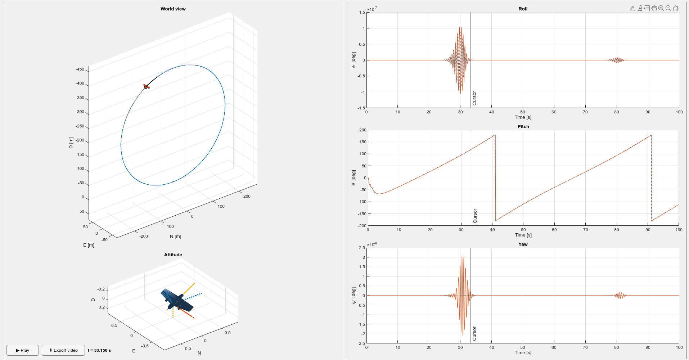

- The main visualization tool is `src/helpers/traj_vis.m` and the UI looks like 
- `messages.m` and `parselog.m` are copied from https://github.com/tudelft/paparazzi_log_parsing/tree/master
- The initial version of `plotAircraftTrajectoryAndAttitudes.m` is developed by Ziqing.
